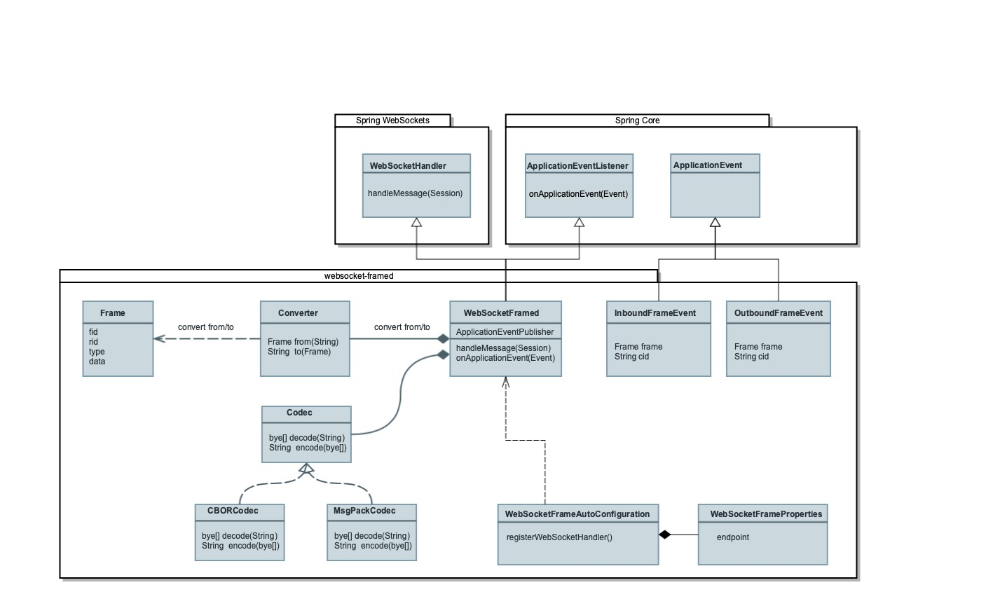

## WebSocket-frame 

This is the Java Spring Boot implementation of the WebSocket-Framed Module of .... 

## Overview  


## Class Design 


## 

```Frame``` is the Class representation of a Web Socket Frame, based on the ... Subprotocol  The ```Converter``` is responsable to convert a WebSocket Frame to a Frame Object an vice versa. The ```Codec``` is responsable to decode and encode the WebSocket frame. The frame itself is encoded with either the object serialization format JavaScript Object Notation (**JSON**, RFC4627), Concise Binary Object Representation (**CBOR**, RFC7049) or MsgPack. Therefore it exits with ```CBORCodec``and ``MsgPackCodec``` to implementations of the ```Codec``` Interface. The central component is the ```WebSocketFramed``` which extends the ```WebSocketHandler``` which is part of the **Spring WebSocket Module**. The Spring Configuration ... register the Handler


