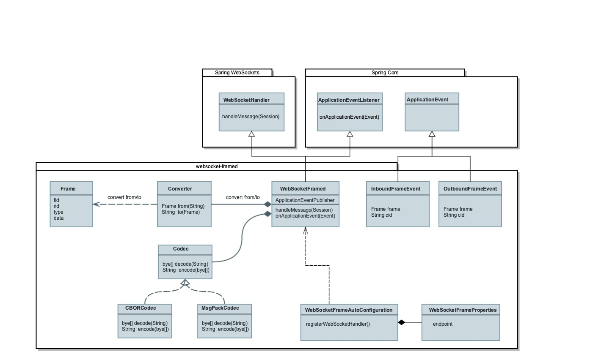

## WebSocket-frame 

This is the Java Spring Boot implementation of the WebSocket-Framed Module of .... 

## Overview  


## Class Design 


```Frame``` is the **Class** representation of a Web Socket-Frame, based on the ... Subprotocol.  The ```Converter``` is responsable to convert a WebSocket-Frame to a Frame-Object and vice versa. The ```Codec``` is responsable to decode and encode the WebSocket-Frame. The frame itself is encoded with either the object serialization format JavaScript Object Notation (**JSON**, RFC4627), Concise Binary Object Representation (**CBOR**, RFC7049) or MsgPack. Therefore it exits ```CBORCodec``` and ```MsgPackCodec``` two implementations of the ```Codec``` Interface. The central component is the ```WebSocketFramed``` which extends the ```WebSocketHandler``` which is part of the **Spring WebSocket Module**. The Spring Configuration ```WebSocketFramedAutoConfiguration```register the Handler and the properties for example the URL can be configured over ```WebSocketFramedProperties```. The Hanlder ist connected to the WebSocket Container of a WebSocket Server like Tomcat, Jetty etc. The internal communication between other undepenend modules in the sampe process will be handeld by the **Spring Event** mechanism. After a frame is received a ```InboundFrameEnvend``` will be published. After an ```OutboundFrameEvent``` is received a frame will be sended to the clients. For the inter-process communication (IPC) .... 


